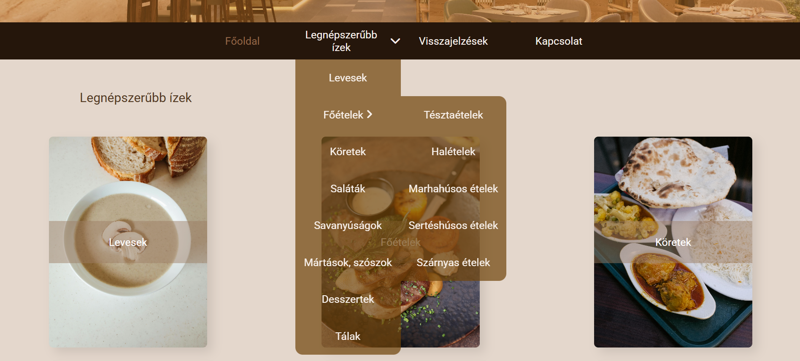

  🌐 <a href="README.md">Magyar verzió</a>

# Homemade Flavors – Responsive Website

**Language:** [HU Magyar](README.md) | GB English

This project was created as a **homework assignment** during the first module of the Fullstack Web Developer course (HTML + CSS + basic JavaScript/jQuery).
It represents the implementation of a fictional gastronomic website demonstrating responsive layout techniques and dynamic navigation.

## Description

Homemade Flavors is a simple yet fully responsive website that:
- demonstrates the use of grid and flexbox layout systems,
- includes a multi-level dropdown navigation menu,
- provides responsive design with multiple breakpoints (media queries),
- uses jQuery to handle the mobile navigation menu,
- applies modern, aesthetic typography via Google Fonts.

## File Structure

hazias_izek/
│── assets/
│   └── images/            # Images
│
│── hazias_izek.html       # Main HTML page
│── jQuery.js              # Local jQuery library
│── README.md              # Documentation (Hungarian version)
│── README_EN.md           # Documentation (English version)
│── scripts.js             # jQuery-based interactions
│── styles.css             # Main stylesheet (grid + media queries)

## Main Features

- Fully responsive web design (mobile, tablet, desktop)
- Multi-level dropdown navigation menu
- Hamburger menu for mobile view
- jQuery-powered menu animations and interactions
- Aesthetic grid layout with image cards
- Feedback section using grid layout

## How to Run

1. Download or clone the repository: git clone https://github.com/username/hazias_izek.git

2. Open the file: **hazias_izek.html** in your browser.

## Created by

Name: Zita Lukács
Date: May 2024
Module: HTML + CSS (+ basic JS) – Front-End Web Development